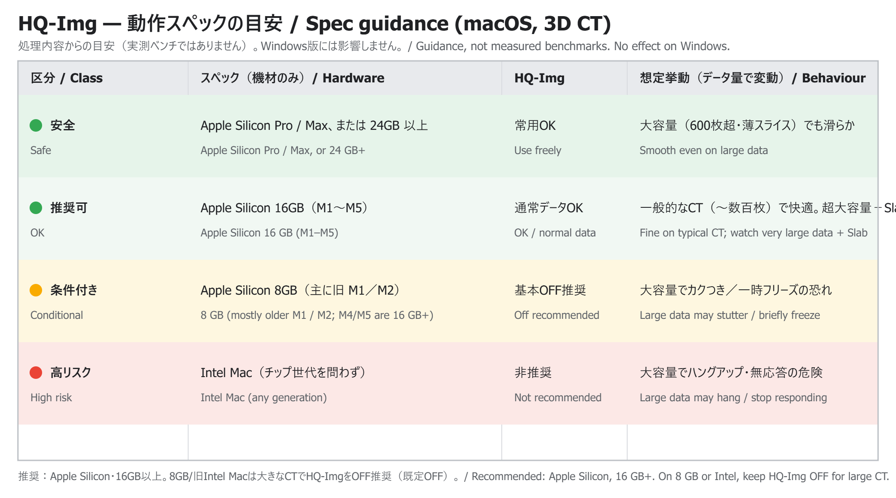

# HQ-Img について / About "HQ-Img" (macOS, 3D CT)

> 数値・区分は処理内容から導いた**目安**です（実測ベンチマークではありません）。
> Windows 版には影響しません。
>
> Figures below are **guidance** derived from the processing involved
> (not measured benchmarks). No effect on the Windows build.

Source (editable): [`hq-img-spec.svg`](hq-img-spec.svg)

---

## 日本語

**HQ-Img** は、画像の拡大・回転・移動などの操作中も MPR を**フル画質で再構成し続ける**
機能です。きれいに見える一方、操作のたびに毎フレーム フル解像度の再構成（＋ Slab 表示時は
スラブ合成）を行うため、GPU・ユニファイドメモリへの負荷が高くなります。

ボタンは **Plane 段の最も左**にあり、**ON のときは青く**表示されます。**既定は OFF** です。

- **推奨環境：Apple Silicon・メモリ 16GB 以上**
- **8GB の Mac（主に旧世代 M1／M2）や旧 Intel Mac** では、大きな CT データ（薄スライス・
  多枚数）で**動作が重くなったり一時的に固まる**ことがあります。その場合は HQ-Img を
  **OFF（既定）**にしてください。

| 区分 | スペック（機材のみ） | HQ-Img | 想定挙動（データ量で変動） |
|---|---|---|---|
| 🟢 安全 | Apple Silicon **Pro / Max**、または **24GB 以上** | 常用OK | 大きなデータ（600枚超・薄スライス）でも滑らか |
| 🟢 推奨可 | Apple Silicon **16GB**（M1〜M5） | 通常データOK | 一般的な CT（〜数百枚）で快適。超大容量＋Slab 同時のみ注意 |
| 🟡 条件付き | Apple Silicon **8GB**（主に旧世代 M1／M2。M4/M5 は 16GB〜） | 基本OFF推奨 | データが大きいほど重く、大容量で**カクつき／一時フリーズ**の恐れ |
| 🔴 高リスク | **Intel Mac**（チップ世代を問わず） | 非推奨 | フル画質再構成が重く、大きなデータで**ハングアップ・無応答**の危険 |

**補足**
- 「大容量」は **CT データの大きさ**（スライス枚数・薄さ）を指し、マシンスペックとは別の要因です。
- **8GB 構成は主に旧世代（M1／M2）の機種**です。M4・M5 世代はベースが 16GB 以上のため通常は
  該当しません（**M5 に 8GB 構成は存在しません**）。
- 用語：本ツールの 3DCT は心臓に限らない汎用 MPR のため、原則 **「CT」** と表記します
  （心筋・弁が対象＝「心臓CT」、冠動脈血管のみ＝「冠動脈CTA」）。

---

## English

**HQ-Img** keeps the MPR at **full resolution even while you drag / zoom / rotate**
(it turns the coarse interactive preview OFF). It looks sharper, but it
re-reconstructs every frame (plus a slab composite when Slab is on), so it is
heavier on the GPU and unified memory.

The button is at the **far left of the Plane row**; the **blue state means ON**.
**Default is OFF.**

- **Recommended: Apple Silicon with 16 GB or more.**
- On **8 GB Macs (mostly older M1 / M2)** or **older Intel Macs**, large CT data
  (thin slices, many images) may **stutter or briefly freeze** — turn HQ-Img
  **OFF** (the default) in that case.

| Class | Hardware (machine only) | HQ-Img | Behaviour (varies with data size) |
|---|---|---|---|
| 🟢 Safe | Apple Silicon **Pro / Max**, or **24 GB+** | Use freely | Smooth even on large data (600+ slices, thin) |
| 🟢 OK | Apple Silicon **16 GB** (M1–M5) | OK for normal data | Comfortable on typical CT (~hundreds of slices); watch only very large data + Slab together |
| 🟡 Conditional | Apple Silicon **8 GB** (mainly older M1 / M2; M4/M5 ship with 16 GB+) | Off recommended | Heavier as data grows; large data may stutter / briefly freeze |
| 🔴 High risk | **Intel Mac** (any generation) | Not recommended | Full-quality reconstruction is heavy; large data may hang / stop responding |

**Notes**
- "Large data" means the **size of the CT** (slice count / thinness) — a separate
  factor from machine spec.
- **8 GB configurations are mostly older (M1 / M2) machines.** M4 / M5 ship with
  16 GB or more, so they generally do not apply (**there is no 8 GB M5**).
- Terminology: this app's 3D CT is a general MPR tool (not heart-only), so we say
  just **"CT"** ("cardiac CT" only when myocardium/valves are in view; "coronary
  CTA" only for coronary-vessel-only imaging).
